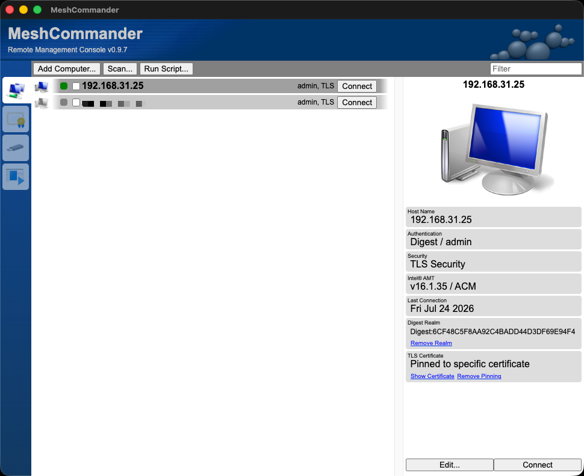
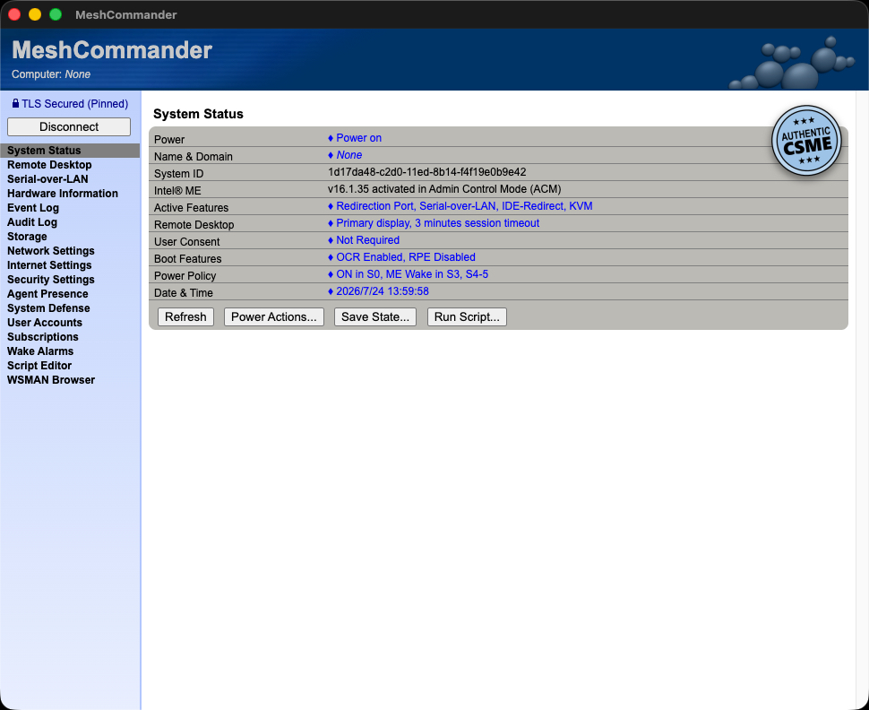
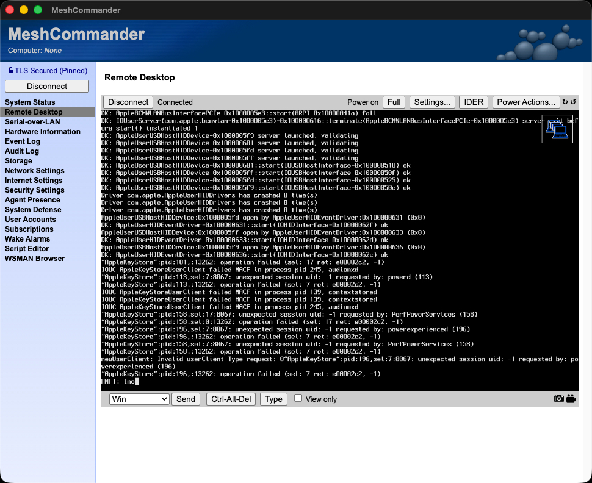
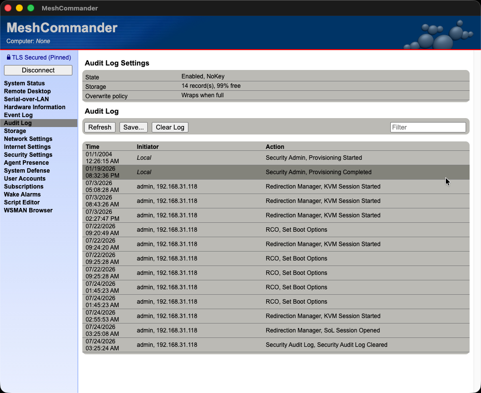

# MeshCommander for macOS

<p align="center">
  <a href="https://github.com/ljzxzxl/meshcommander-for-mac/releases">
    <strong>Download MeshCommander for macOS / 下载最新版 DMG</strong>
  </a>
</p>

<table>
  <tr>
    <td width="28%" align="center">
      
      <br>
      <strong>App Icon / 应用图标</strong>
    </td>
    <td width="72%" align="center">
      
      <br>
      <strong>Device List / 设备列表</strong>
    </td>
  </tr>
</table>

A native macOS build of [MeshCommander](https://github.com/Ylianst/MeshCommander), the Intel® AMT (vPro) remote management console — with Hardware-KVM, Serial-over-LAN, IDER redirection, power control and more. Runs natively on **Apple Silicon (arm64)** and **Intel (x64)** Macs, on current macOS releases.

MeshCommander for macOS 是 [MeshCommander](https://github.com/Ylianst/MeshCommander)（Intel® AMT / vPro 远程管理控制台）的原生 macOS 版本，支持硬件级 KVM 远程桌面、Serial-over-LAN、IDER 虚拟光驱、电源控制等完整功能，原生运行在 **Apple Silicon (arm64)** 和 **Intel (x64)** Mac 及最新版 macOS 上。

## Screenshots / 运行效果

<table>
  <tr>
    <td width="50%" align="center">
      
      <br>
      <strong>System Status / 系统状态</strong>
    </td>
    <td width="50%" align="center">
      
      <br>
      <strong>Hardware-KVM Remote Desktop / 硬件级 KVM 远程桌面</strong>
    </td>
  </tr>
  <tr>
    <td width="50%" align="center">
      
      <br>
      <strong>Device List / 设备列表</strong>
    </td>
    <td width="50%" align="center">
      
      <br>
      <strong>Audit Log / 审计日志</strong>
    </td>
  </tr>
</table>

[English](#english) | [中文](#中文)

## English

MeshCommander is the classic Intel® AMT (vPro) remote management console created by Ylian Saint-Hilaire / Intel. Intel has discontinued the original tool, and the only previous macOS port ([gomesjj/MeshCommander](https://github.com/gomesjj/MeshCommander)) is x64-only and unmaintained since 2021.

This project rebuilds MeshCommander as a modern macOS app:

- Runs natively on **Apple Silicon (arm64)** and **Intel (x64)** — no Rosetta.
- Built on the latest [NW.js](https://nwjs.io/) runtime, works on current macOS releases.
- UI is compiled from unmodified upstream v0.9.7-era sources by an open-source compiler included in this repository (upstream's original "WebSite Compiler" is closed-source and Windows-only).

### Features

- Hardware-KVM remote desktop (works even during BIOS / OS reinstall).
- Serial-over-LAN terminal.
- IDER: mount a local disk image as a remote CD-ROM drive (pure-JavaScript implementation).
- Power control: power on / off / reset / sleep, boot options.
- System status, event log, audit log, hardware inventory.
- Network / security / user account settings, certificate management, TLS with certificate pinning.
- 10 UI languages, switchable at runtime via the Language menu.

### Download

Grab the DMG for your Mac — Apple Silicon (`arm64`) or Intel (`x64`) — from the [Releases page](https://github.com/ljzxzxl/meshcommander-for-mac/releases).

### Installing / first launch

Release builds are currently **ad-hoc signed** (not notarized). On first launch macOS Gatekeeper will block the app. Either:

```bash
xattr -cr /Applications/MeshCommander.app
```

or right-click the app, choose "Open", then confirm — and on macOS 15+ additionally allow it under *System Settings → Privacy & Security*.

### Build from source

Requires macOS 12+, Node.js 18+ and Xcode command line tools.

```bash
node build/mkapp.mjs                      # build for the current machine's architecture
node build/mkapp.mjs --arch x64           # build for Intel Macs
node build/mkapp.mjs --arch arm64 --dmg   # also produce a .dmg
```

Output: `dist/<arch>/MeshCommander.app` (and `dist/*.dmg`).

Continuous integration builds both architectures on every push and attaches DMGs to a GitHub Release whenever a `v*` tag is pushed (see `.github/workflows/build.yml`).

### Repository layout

| Path | Purpose |
|---|---|
| `upstream/` | Unmodified source of [Ylianst/MeshCommander](https://github.com/Ylianst/MeshCommander), kept isolated so it can be re-synced if upstream ever updates |
| `app/` | The NW.js application payload (compiled UI + manifest + macOS icon) |
| `build/mkapp.mjs` | Build script: downloads NW.js, assembles, signs and packages `MeshCommander.app` |
| `compiler/build.mjs` | Open-source replacement for upstream's closed-source Windows-only "WebSite Compiler": compiles the desktop-edition UI directly from `upstream/` sources |
| `docs/` | Screenshots, app icon and the [ONBOARDING](docs/ONBOARDING.md) handover doc |

`app/commander.htm` (and the 9 translated `commander_*.htm` files) are compiled from `upstream/` sources by `compiler/build.mjs`. The compiler strips `###BEGIN###{Feature}` conditional blocks according to `compiler/features.json` (the desktop feature set, extracted from upstream's official `NodeWebkit-Commander.wcc` project file) and inlines all scripts and stylesheets into a single file. Regenerate with:

```bash
node compiler/build.mjs --all      # writes dist/compiled/commander*.htm
cp dist/compiled/commander*.htm app/
```

### Notes

- Old AMT firmware that only supports TLS 1.0/1.1 with legacy ciphers is handled by `app/node-main.js`, which relaxes the Node TLS defaults inside the app.
- Kerberos authentication is not available on macOS (same as the original gomesjj build).
- IDER uses the pure-JavaScript implementation (the Windows-only `imrsdk.dll` path is not used).

### License

[Apache 2.0](upstream/LICENSE), same as upstream MeshCommander. MeshCommander was created by Ylian Saint-Hilaire / Intel Corporation; Intel has discontinued support for the original tool.

## 中文

MeshCommander 是 Ylian Saint-Hilaire / Intel 出品的经典 Intel® AMT (vPro) 远程管理控制台。Intel 已停止维护原版工具，而此前唯一的 macOS 移植版（[gomesjj/MeshCommander](https://github.com/gomesjj/MeshCommander)）只有 x64 架构且自 2021 年起不再更新。

本项目将 MeshCommander 重新构建为现代 macOS 应用：

- 原生运行在 **Apple Silicon (arm64)** 和 **Intel (x64)** 上，无需 Rosetta 转译。
- 基于最新的 [NW.js](https://nwjs.io/) 运行时构建，支持最新版 macOS。
- 界面由本仓库自带的开源编译器直接从未修改的上游 v0.9.7 时代源码编译生成（上游原版 "WebSite Compiler" 是闭源且仅限 Windows 的工具）。

### 功能特性

- 硬件级 KVM 远程桌面（BIOS 界面、重装系统过程中也能使用）。
- Serial-over-LAN 串口终端。
- IDER 虚拟光驱：把本地磁盘镜像挂载为远程机器的 CD-ROM（纯 JavaScript 实现）。
- 电源控制：开机 / 关机 / 重启 / 睡眠、启动项设置。
- 系统状态、事件日志、审计日志、硬件信息。
- 网络 / 安全 / 用户账户设置、证书管理、支持证书固定（Pinning）的 TLS 连接。
- 10 种界面语言，可通过 Language 菜单实时切换。

### 下载

到 [Releases 页面](https://github.com/ljzxzxl/meshcommander-for-mac/releases)下载对应架构的 DMG：Apple Silicon 选 `arm64`，Intel 选 `x64`。

### 安装与首次启动

当前发布版本为 **ad-hoc 签名**（未经过 Apple 公证），首次启动会被 macOS Gatekeeper 拦截。两种解决方式任选其一：

```bash
xattr -cr /Applications/MeshCommander.app
```

或者在 Finder 里右键点击 App 选择「打开」并确认；macOS 15 及以上还需要到「系统设置 → 隐私与安全性」中额外允许一次。

### 从源码构建

要求：macOS 12+、Node.js 18+、Xcode 命令行工具。

```bash
node build/mkapp.mjs                      # 构建当前机器架构的版本
node build/mkapp.mjs --arch x64           # 构建 Intel 版
node build/mkapp.mjs --arch arm64 --dmg   # 同时生成 .dmg
```

产物：`dist/<arch>/MeshCommander.app`（以及 `dist/*.dmg`）。

每次 push 时 CI 会自动构建双架构；推送 `v*` tag 时会自动把 DMG 挂到 GitHub Release（见 `.github/workflows/build.yml`）。

### 仓库结构

| 路径 | 用途 |
|---|---|
| `upstream/` | [Ylianst/MeshCommander](https://github.com/Ylianst/MeshCommander) 的未修改源码快照，单独隔离存放，便于上游更新时重新同步 |
| `app/` | NW.js 应用负载（编译后的界面 + manifest + macOS 图标） |
| `build/mkapp.mjs` | 构建脚本：下载 NW.js、组装、签名并打包 `MeshCommander.app` |
| `compiler/build.mjs` | 上游闭源 Windows 专用 "WebSite Compiler" 的开源替代实现：直接从 `upstream/` 源码编译桌面版界面 |
| `docs/` | 截图、应用图标以及[交接文档](docs/ONBOARDING.md) |

`app/commander.htm`（及 9 个翻译版 `commander_*.htm`）由 `compiler/build.mjs` 从 `upstream/` 源码编译生成。编译器按 `compiler/features.json`（桌面版功能集，提取自上游官方 `NodeWebkit-Commander.wcc` 工程文件）裁剪 `###BEGIN###{Feature}` 条件块，并把所有脚本和样式表内联进单个文件。重新生成：

```bash
node compiler/build.mjs --all      # 输出到 dist/compiled/commander*.htm
cp dist/compiled/commander*.htm app/
```

### 说明

- 只支持 TLS 1.0/1.1 和旧加密套件的老旧 AMT 固件，由 `app/node-main.js` 在应用内放宽 Node 的 TLS 默认限制来兼容。
- macOS 上不支持 Kerberos 认证（与原 gomesjj 版本一致）。
- IDER 使用纯 JavaScript 实现（不使用仅限 Windows 的 `imrsdk.dll` 路径）。

### 许可证

[Apache 2.0](upstream/LICENSE)，与上游 MeshCommander 一致。MeshCommander 由 Ylian Saint-Hilaire / Intel 公司创建，Intel 已停止对原版工具的支持。
